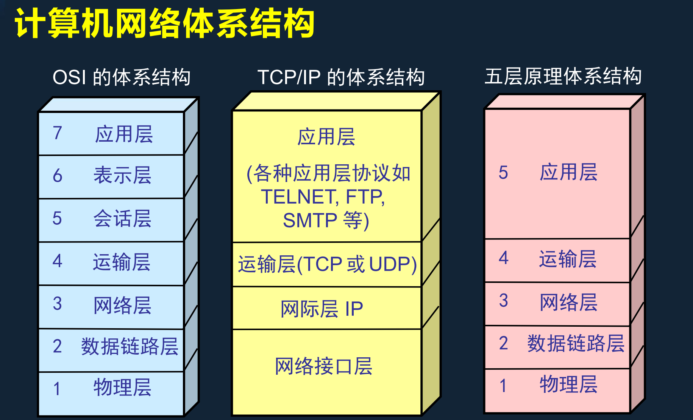
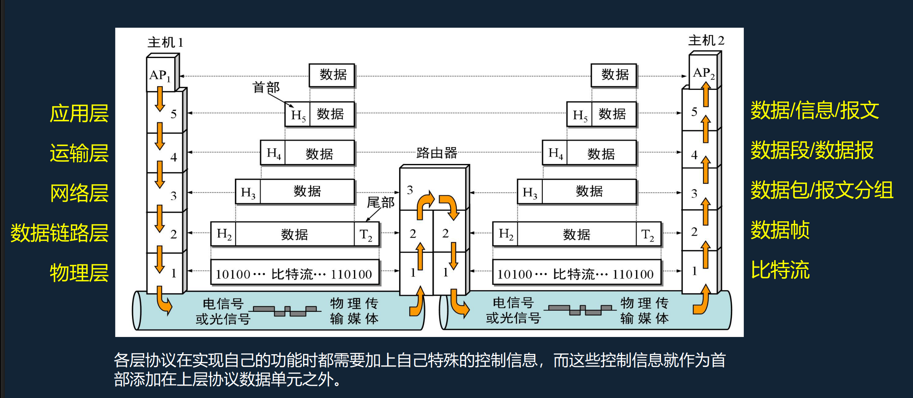
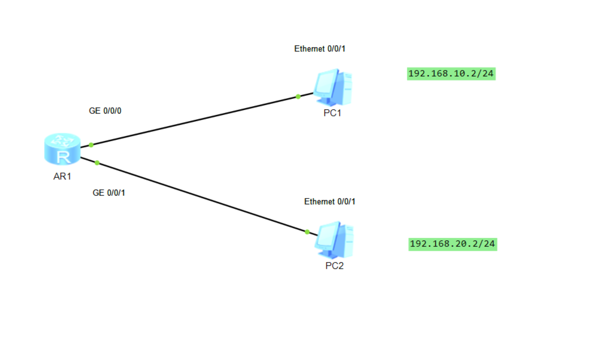
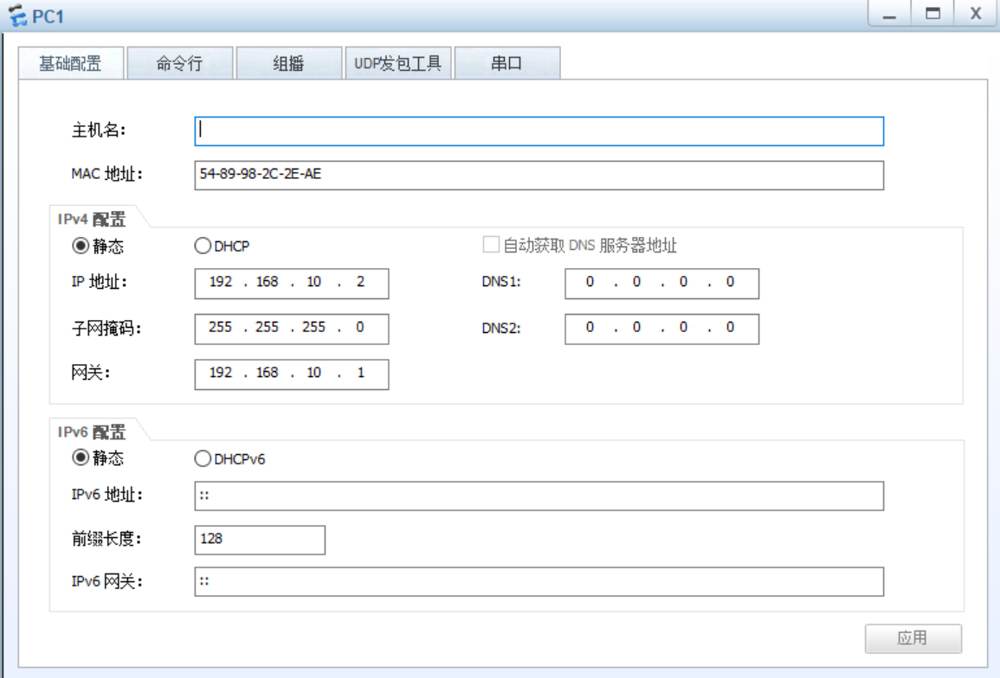
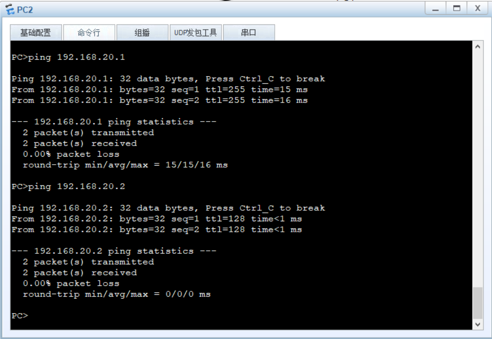
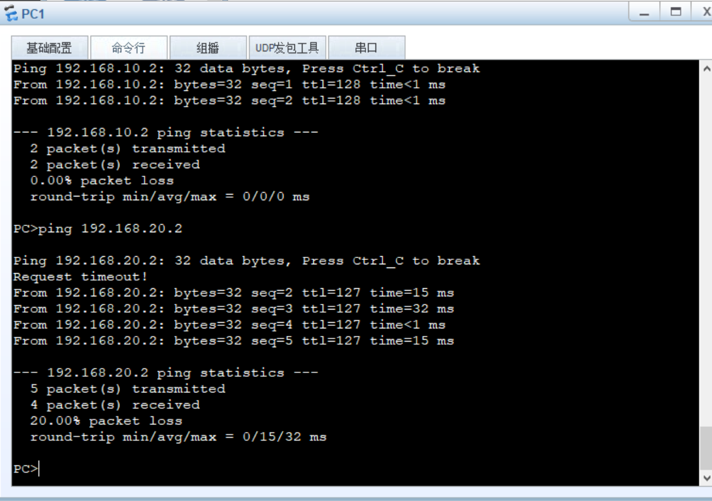
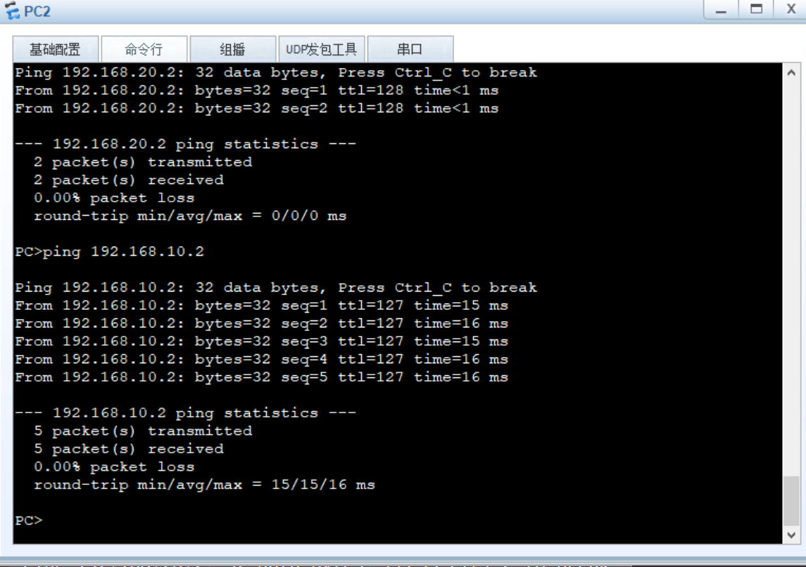

---

title:  "Network Engineer"    # 建议加双引号，防止标题中有冒号或特殊字符导致解析失败"
date: 2026-05-03T20:00:00+08:00 # 建议带上 ISO 8601 时间戳，方便精准排序和时区对齐
categories: ["Network"]         # 使用标准的 YAML 数组格式 []，可扩展性更好
tags: ["Engineer"]    # 强烈建议增加 tags 字段，这在 Hugo 中是默认的二级索引
draft: false                  # 显式声明发布状态，防止漏发

---


## 1.x：


---


### 1️⃣ **网络体系结构与通信过程**：探讨 OSI 七层模型与 TCP/IP 模型的对应关系，以及数据在各层是如何自上向下封装、自下向上解封装的 。


```

网络协议三要素:


语法（Syntax）： 规定数据与控制信息的结构或格式 。


语义（Semantics）： 规定各个控制信息的具体含义 。
                    比如系统发出这个控制信息，是要求完成何种动作（是建立连接还是断开连接）。


同步 / 时序（Timing）： 对事件实现顺序和时间的详细说明 。比如数据应该在何时发送、以多快的速率发送 。

```


#### 考点二：架构师的系统分层视角（三大体系结构对比）




- 为了把庞大复杂的网络通信转化为可处理的局部问题，网络采用了分层设计 。必须分清三种模型的区别：


```

1. OSI 七层参考模型（学院派标杆）:


自上而下分为：应用层、表示层、会话层、运输层、网络层、数据链路层、物理层 。


架构体感： 概念清楚、理论完整，但由于设计得既复杂又不实用，大厂落地时基本不用 。


2023年5月真题考过，在 OSI 模型中，负责对应用层消息进行压缩、加密功能的层次是表示层

```

  

```

2. TCP/IP 四层模型（工业界事实标准）：


自上而下分为：应用层（对应各种协议如 TELNET, FTP, SMTP 等）、
                运输层（TCP 或 UDP）、网际层（IP）、网络接口层 。


架构体感： 最下面的网络接口层其实是一个“黑盒”，并没有定义具体内容 。

```


```

3. 五层原理体系结构（软考核心模型） 为了兼顾学习和研究，我们将 OSI 和 TCP/IP 结合，采用五层协议模型 。这是必须死磕的模块：

  
应用层： 通过应用进程间的交互完成特定网络应用 。


运输层： 负责向两台主机进程间通信提供通用数据传输服务 。

  2024年5月真题直接考了，TCP 协议与 UDP 协议正是工作在运输层（也叫传输层） 。


网络层： 负责为分组交换网上的不同主机提供通信服务 。


数据链路层： 将分组从链路的一端传送到另一端 。


物理层： 负责在传输媒体上传送纯粹的比特流 。

```


#### 考点三：数据生命周期（封装与解封装全景追踪）




- 在 DevOps 自动化链路里，这就像是代码被层层打包成 Docker 镜像的过程。网络通信的本质规律是：**发送方自上向下封装数据，接收方自下向上解封装数据** 。


```

当主机 1 向主机 2 发送数据时，请牢记每一层为数据添加“首部（Header）”和改变数据单元名称的过程 ：


第 5 层 应用层： 产生最原始的业务数据，此时的单位叫 数据/信息/报文 。


第 4 层 运输层： 加上运输层首部 (H_4)，此时的数据包被切割，单位叫 数据段/数据报 。


第 3 层 网络层： 加上网络层首部 (H_3，包含源和目的 IP 地址)，此时单位叫 数据包/报文分组


第 2 层 数据链路层（⚠ 绝对的陷阱考点）： 其他层只加首部，但数据链路层为了确保数据完整性，不仅要加上首部 (H_2 包含 MAC 地址)，还要加上尾部 (T_2 校验和) 。此时单位叫 数据帧 。


第 1 层 物理层： 没有任何首部和尾部了，所有的数据全部转换为底层硬件识别的 10100... 比特流，最终变成电信号 / 光信号在物理传输媒体上狂奔 。

```

---

### 2️⃣ 数据通信与信道极限计算：解析曼彻斯特等编码方式、信号调制技术，以及历年常考的奈氏准则和香农公式计算题型 。


---

### 3️⃣ **物理层基建与复用接入技术**：对比各类传输媒体（如单模与多模光纤），拆解信道复用方式（FDM/TDM/WDM/CDM），以及剖析 FTTx 接入网架构中的 OLT 与 ONU 核心节点 。


---


---
---


### 让不同网段下的pc互通：

- 拓扑图：




- pc1：




- pc2：




---

#### AR2220配置

- 0/0/0接口：192.168.10.1/24

- 0/0/1接口：192.168.20.1/24

```

[Huawei]interface giga	
[Huawei]interface GigabitEthernet 0/0/0
[Huawei-GigabitEthernet0/0/0]ip address 192.168.10.1 24
May  3 2026 18:52:02-08:00 Huawei %%01IFNET/4/LINK_STATE(l)[0]:The line protocol
 IP on the interface GigabitEthernet0/0/0 has entered the UP state. 
[Huawei-GigabitEthernet0/0/0]undo shutdown
Info: Interface GigabitEthernet0/0/0 is not shutdown.
[Huawei-GigabitEthernet0/0/0]q
[Huawei]q
<Huawei>save
  The current configuration will be written to the device. 
  Are you sure to continue? (y/n)[n]:y
  It will take several minutes to save configuration file, please wait.......
  Configuration file had been saved successfully
  Note: The configuration file will take effect after being activated
<Huawei>sys
Enter system view, return user view with Ctrl+Z.
[Huawei]inter	
[Huawei]interface giga	
[Huawei]interface GigabitEthernet 0/0/1
[Huawei-GigabitEthernet0/0/1]ip add	
[Huawei-GigabitEthernet0/0/1]ip address 192.168.20.1 24
May  3 2026 18:53:06-08:00 Huawei %%01IFNET/4/LINK_STATE(l)[1]:The line protocol
 IP on the interface GigabitEthernet0/0/1 has entered the UP state. 
[Huawei-GigabitEthernet0/0/1]
[Huawei-GigabitEthernet0/0/1]q
[Huawei]q
<Huawei>save
  The current configuration will be written to the device. 
  Are you sure to continue? (y/n)[n]:y
  It will take several minutes to save configuration file, please wait.......
  Configuration file had been saved successfully
  Note: The configuration file will take effect after being activated


```


---


#### 测试两台pc间连通性：

- pc1



- pc2



#### 成功互相ping通！！

---
---


